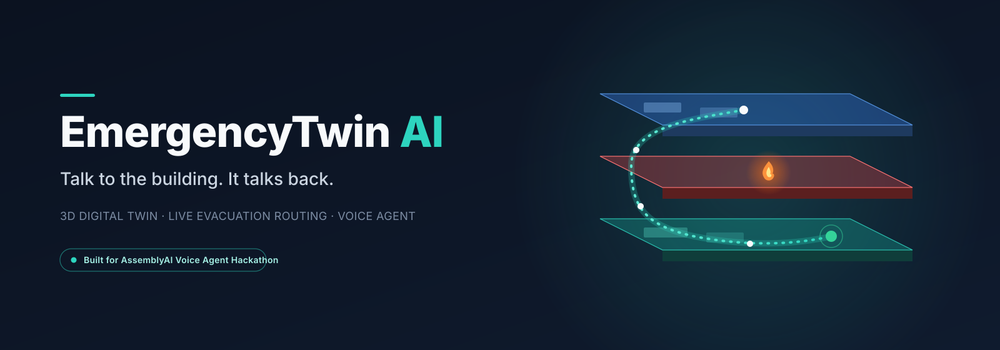

<p align="center">

</p>

<h1 align="center">EmergencyTwin AI</h1>
<p align="center">A live 3D digital twin of a building — with a real <a href="https://www.assemblyai.com/">AssemblyAI Voice Agent</a> that Security staff and building occupants can talk to during an emergency.</p>

<p align="center">
  <a href="#">Live demo</a> ·
  <a href="#">Demo video</a> ·
  <a href="#getting-started">Run it locally</a>
</p>

---

## What this is

Most emergency evacuation decisions are made with a static floor plan and guesswork — nobody has a real-time view of which routes are actually safe, and there's no easy way for someone inside the building to ask for help hands-free during a crisis.

EmergencyTwin AI turns a building into an interactive 3D digital twin, wired directly to a voice agent. Say what's happening, and the building responds — for real. Blocking an exit by voice actually blocks it in the route graph; every occupant near that exit gets a new route, live, in the 3D view.

Built for the **AssemblyAI Voice Agent Hackathon**.

## Key features

- **Live 3D digital twin** — a procedurally generated 3-floor mall: rooms, corridors, doors, stairs, an elevator, and emergency exits, each with real semantic data. Rotate, switch floors, click anything to inspect it.
- **Real route engine** — a navigation graph with Dijkstra shortest-path routing, not a canned answer. Routes visibly re-highlight in 3D when the graph changes.
- **Emergency engine** — start a fire incident, block an exit or a corridor, and watch the affected zones turn red/gray and every route recalculate around them. Elevators are automatically excluded from evacuation routing during any fire.
- **AssemblyAI Voice Agent, two modes:**
  - **Security** — "What's happening on floor 2?", "Start a fire on floor 2", "Block the west exit", "Start an evacuation simulation."
  - **Occupant** — "I'm in Room 305, help me find an exit," or report a new hazard by voice: "There's smoke near the food court" — the building updates for everyone, live.
- **Simulated occupants** — dozens of occupants evacuate toward their nearest exit and reroute automatically the moment the building state changes.
- **What-if simulation & occupant guidance** — compare a hypothetical exit closure before committing to it; get plain-language, step-by-step directions generated from the real calculated route (never invented).
- **Incident report export** — a JSON report of the incident, routes, and guidance, one click.

## How it works

```
 Voice (mic) ──▶ AssemblyAI Voice Agent (STT + LLM + TTS, one WebSocket)
                        │
                        │ tool.call (find_route, block_exit, create_incident, ...)
                        ▼
              Browser-side tool functions
                        │
        ┌───────────────┼────────────────┐
        ▼               ▼                ▼
   Route graph    Emergency engine   Occupant simulation
   (Dijkstra)     (incidents,        (evacuation,
                   blocking)          live rerouting)
        │               │                │
        └───────────────┴────────────────┘
                        ▼
              Three.js 3D scene — updates live
```

The whole app is **one self-contained `index.html`** (vanilla JavaScript + Three.js — no framework, no build step) plus a single Vercel serverless function that mints a short-lived AssemblyAI token, so the real API key never reaches the browser.

## Tech stack

| Piece | Technology |
|---|---|
| 3D rendering | [Three.js](https://threejs.org/) |
| Voice (STT + LLM reasoning + TTS + tool-calling) | [AssemblyAI Voice Agent API](https://www.assemblyai.com/) |
| Hosting | [Vercel](https://vercel.com/) — static file + one serverless function |
| Everything else | Vanilla JavaScript, no framework |

## Getting started

```bash
git clone https://github.com/Hamna-Munir/emergencytwin-voice.git
cd emergencytwin-voice
```

1. Get a free API key from the [AssemblyAI dashboard](https://www.assemblyai.com/dashboard/signup).
2. Deploy to [Vercel](https://vercel.com) (Import Project → this repo → Framework Preset: **Other**).
3. In your Vercel project's **Environment Variables**, add:
   ```
   ASSEMBLYAI_API_KEY=your_key_here
   ```
4. Deploy. Open the live URL, click **Voice**, choose **Security** or **Occupant**, click **Start voice session**, and speak.

> The voice assistant only works on a real deployment (it needs a server to mint the token and a browser mic) — opening `index.html` directly as a local file won't connect.

## Try saying

**Security mode**
- "What's happening on floor 2?"
- "Start a fire on floor 2."
- "Block the west exit."
- "Start an evacuation simulation."

**Occupant mode**
- "I'm in Room 305, help me find an exit."
- "There is smoke near the food court."

## Project structure

```
index.html          the entire app — twin, routing, emergency engine,
                     occupant simulation, voice client, UI
api/
  voice-token.js     Vercel serverless function — mints a short-lived
                     AssemblyAI token; the only place the real API key
                     is used
```

## Limitations

This is a hackathon prototype and decision-support simulation — not certified for real emergency/life-safety deployment. A few things are intentionally simplified for the demo:

- Crowd numbers are a scaled-down simulated population, not literal building capacity.
- The Security dashboard is a compact activity feed rather than a full alerts/timeline panel.
- What-if scenarios run through the UI; a fully voice-driven "what if → apply it" flow is the next thing to add.

## License

MIT
